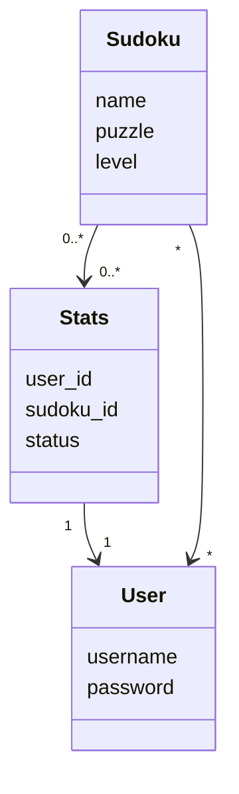

# Arkkitehtuurikuvaus

## Sovelluslogiikka

Sovelluksen looginen tietomalli koostuu luokista User, Sudoku ja Stats (puuttuu sovelluksesta vielä toistaiseksi),jotka kuvaavat käyttäjiä, pelattavia sudokuja sekä käyttäjien pelitietoja:

Luokka SudokuService vastaa sovelluksen toiminnallisista kokonaisuuksista. Sen metodeja ovat mm.:

- `login(username, password)`
- `create_user(username, password)`
- `read_sudokus(file_path, level)`
- `check_sudoku_win(sudoku)`
- `get_sudokus(level)`
- `numbers_to_puzzle(sudoku)`

_SudokuService_ pääsee käsiksi käyttäjä- ja sudokuolioihin luokkien UserRepository ja SudokuRepository kautta. Ne vastaavat käyttäjätietojen, sudokujen ja pelitilastojen käsittelystä ja tallennuksesta tietokantaan.

Luokka/pakkauskaavio:

