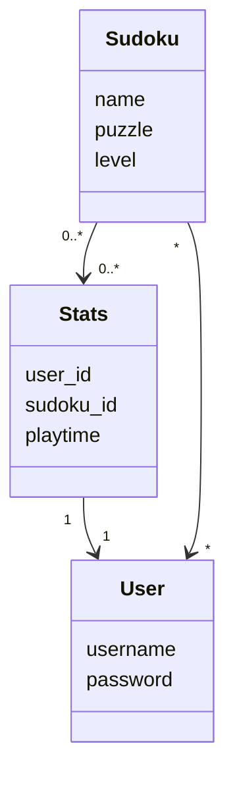
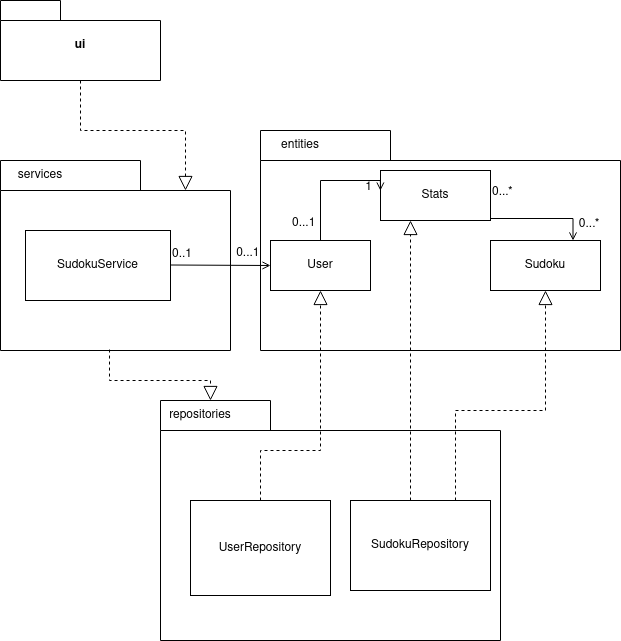
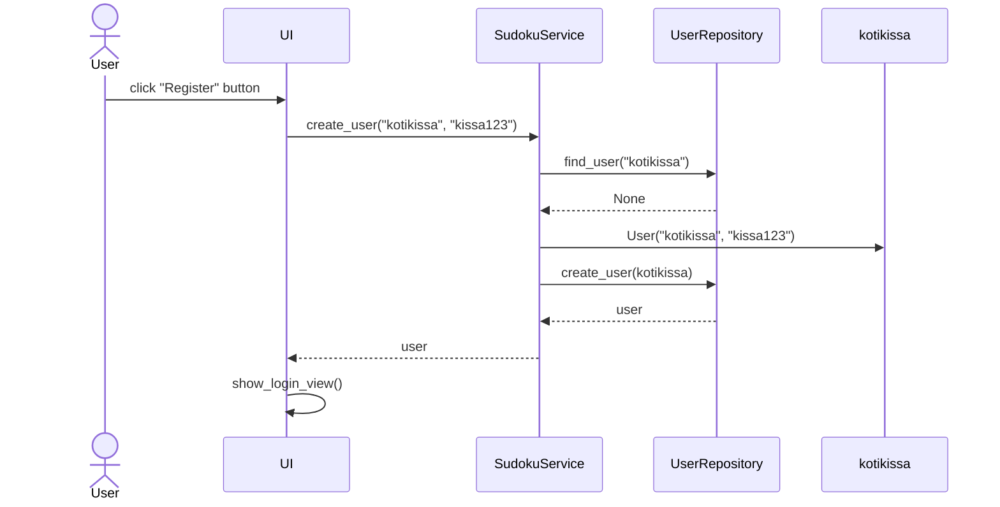
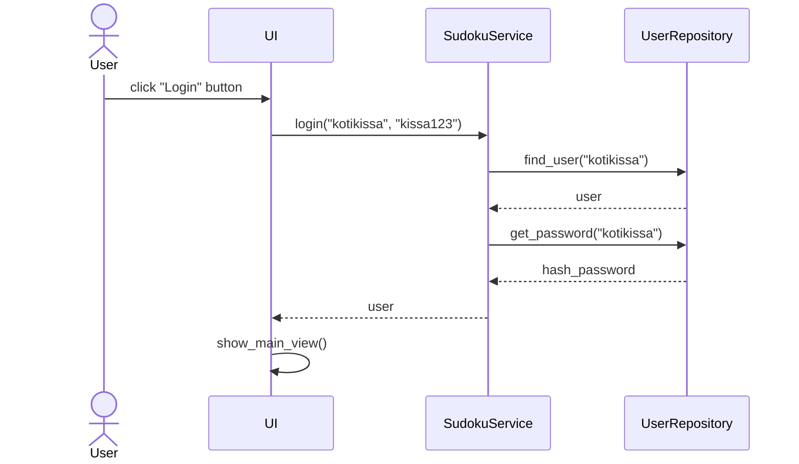
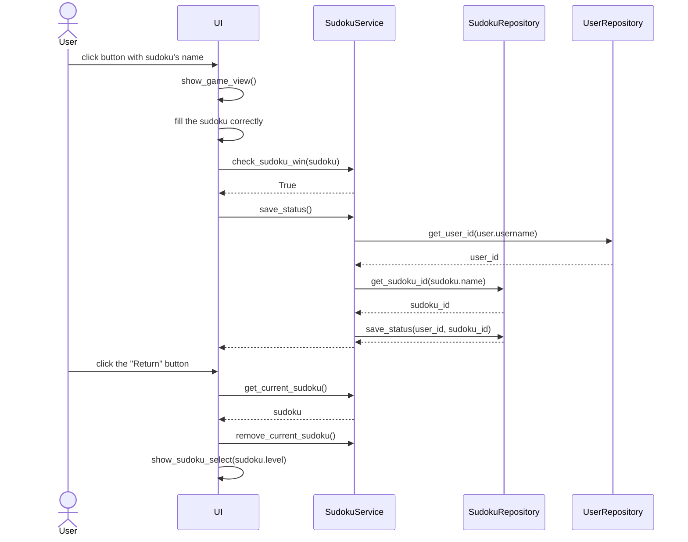

# Arkkitehtuurikuvaus

## Sovelluslogiikka

Sovelluksen looginen tietomalli koostuu luokista User, Sudoku ja Stats,jotka kuvaavat käyttäjiä, pelattavia sudokuja sekä käyttäjien pelitietoja:



Luokka SudokuService vastaa sovelluksen toiminnallisista kokonaisuuksista. Sen metodeja ovat mm.:

- `login(username, password)`
- `create_user(username, password)`
- `read_sudokus(file_path, level)`
- `check_sudoku_win(sudoku)`
- `get_sudokus(level)`
- `numbers_to_puzzle(sudoku)`

_SudokuService_ pääsee käsiksi käyttäjä- ja sudokuolioihin luokkien UserRepository ja SudokuRepository kautta. Ne vastaavat käyttäjätietojen, sudokujen ja pelitilastojen käsittelystä ja tallennuksesta tietokantaan.

Luokka/pakkauskaavio:



## Tietojen tallennus

Sovelluksen luokat `UserRepository` ja `SudokuRepository` vastaavat tietojen tallennuksesta SQLite-tietokantaan. SudokuRepository lukee pelattavat sudokutiedostot txt-tiedostosta.

### Tiedostot

Sovellus tallettaa tietokantojen sisällön .sqlite-tiedostoon, jonka nimi on määritelty konfiguraatiotiedostossa [.env](https://github.com/jnnhan/ot-sudoku/blob/main/.env). Kyseisessä tiedostossa on määritelty myös tiedostot, joihin uudet sudokut lisätään ja joista ne luetaan. Sudokujen luku tapahtuu tiedoston [read_sudokus.py](https://github.com/jnnhan/ot-sudoku/blob/main/src/read_sudokus.py) kautta.

Sudokut ovat tekstitiedostoissa seuraavanlaisessa formaatissa:

```
759620004
016040000
000005900
601004000
000713046
080062090
000208009
300000650
198056070
.easy3
```

Ensin on syötetty järjestyksessä ja allekkain sudokun 9 riviä. Luvut 0 merkitsevät tyhjiä ruutuja. Kymmenes rivi aloitetaan pisteellä, jonka jälkeen on kirjoitettu sudokun nimi. Sudokujen nimiet ovat uniikkeja.

Käyttäjät tallennetaan SQLite-tietokannan tauluun  `users`, sudokut tauluun `sudokus` ja pelitiedot tauluun `stats`. Nämä taulut alustetaan tiedostossa [init_database.py](https://github.com/jnnhan/ot-sudoku/blob/main/src/init_database.py).

## Toiminnallisuudet sekvenssikaaviona

### Uuden käyttäjän luonti

Sovelluksen käynnistymisen jälkeen klikataan _'Create new username'_-painiketta, ja syötetään ilmestyviin kenttiin uusi käyttäjänimi ja oikeellinen salasana. Lopuksi klikataan 'Register'-painiketta, jonka jälkeen uudella käyttäjätunnuksella voi kirjautua sisään.



Tapahtumakäsittelijä kutsuu sovelluslogiikan, eli `SudokuService`:n, metodia `create_user`, jolle annetaan parametriksi uusi käyttäjätunnus ja salasana. Sovelluslogiikka selvittää  `UserRepository`-luokan metodin `find_user` avulla onko annettu käyttäjätunnus jo olemassa. Jos ei, sovelluslogiikka luo `User`-olion annetuilla parametreilla, ja se tallennetaan tietokantaan kutsumalla `UserRepository`-luokan metodia `create_user`. Kyseisessä metodissa merkkijonomuotoinen salasana hashataan `werkzeug`-kirjaston metodin `generate_password_hash` avulla. Tämän jälkeen käyttöliittymä vaihtaa näkymäksi sisäänkirjautumisnäkymän, eli `LoginView`:n.

### Sisäänkirjautuminen

Sovelluksen kirjautumisnäkymän kenttiin syötetään olemassaoleva käyttäjätunnus ja sitä vastaava salasana, ja klikataan _'Login'_-painiketta. 



Tapahtumakäsittelijä reagoi painikkeen painamiseen ja kutsuu sovelluslogiikan `SudokuService` metodia `login`, joka saa parametrikseen käyttäjän syöttämän käyttäjätunnuksen ja salasanan. Sovelluslogiikka selvittää `UserRepository`:n avulla ensin onko käyttäjätunnusta vastaava käyttäjä olemassa. Jos on, tarkistetaan seuraavaksi vastaako käyttäjän syöttämä salasana tietokantaan talletettua hash-salasanaa. Jos kaikki täsmää, käyttöliittymä vaihtaa näkymäksi `MainView`:n, eli sovelluksen päänäkymän, jonka kautta sudokupelin vaikeustason voi valita.

### Sudokun pelaaminen

Käyttäjä valitsee pelattavan sudokun klikkaamalla sen nimeä. Käyttäjä syöttää kenttiin oikeat numerot ja pelin pelattuaan painaa _'Return'_-painiketta.



Tapahtumäkäsittelijä näyttää pelinäkymän ja tarkistaa jokaisen uuden syötetyn numeron jälkeen onko ruudukko täynnä. Jos on, kutsutaan sovelluslogiikan `SudokuService` metodia `check_sudoku_win`, joka tarkistaa ovatko syötetyt numerot oikein. Jos ovat, kutsutaan seuraavaksi sovelluslogiikan metodia `save_status`, joka tallentaa `SudokuRepository`:n kautta tietokantaan tiedon pelaajan ratkaisemasta sudokusta. Käyttäjän klikattua _'Return'_-painiketta kutsutaan sovelluslogiikan metodia `get_current_sudoku`, jonka avulla saadaan tietoon juuri pelatun sudokun vaikeustaso. Tämä vaikeustaso annetaan parametrina käyttöliittymän näkymäluokalle `SudokuSelectView`.

### Muut toiminnallisuudet

Muut sovelluksen toiminnallisuudet seuraavat samaa periaatetta. Käyttäjän valintojen mukaan käyttöliittymän tapahtumakäsittelijä kutsuu sovelluslogiikan metodia, josta tapahtumasta riippuen kutsutaan `SudokuRepository`:n tai `UserRepository`:n metodeita.
