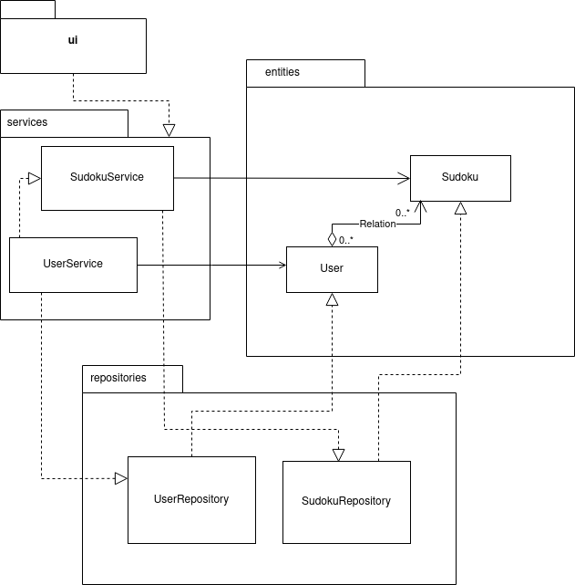

# Arkkitehtuurikuvaus

## Sovelluslogiikka

Sovelluksen looginen tietomalli koostuu luokista User, Sudoku ja Stats,jotka kuvaavat käyttäjiä, pelattavia sudokuja sekä käyttäjien pelitietoja:

Luokka _UserService_ vastaa sovelluksen käyttäjätietoihin liittyvistä toiminnallisista kokonaisuuksista. Sen metodeja ovat mm.:

- `login(username, password)`
- `create_user(username, password)`
- `get_playtime(user_id, sudoku_id)`

Luokka _SudokuService_ vastaa sovelluksen sudokuihin liittyvistä toiminnallisista kokonaisuuksista. Sen metodeja ovat mm.:

- `check_sudoku(sudoku)`
- `check_new_sudoku_input(sudoku)`
- `get_sudokus(level)`
- `numbers_to_puzzle(sudoku)`

_UserService_ pääsee käsiksi käyttäjäolioihin luokan UserRepository kautta. Se vastaa käyttäjätietojen käsittelystä ja tallennuksesta tietokantaan. Luokka hyödyntää myös luokkaa _SudokuService_ tallentaakseen käyttäjän tiettyä sudokua koskevia pelitietoja.

_SudokuService_ pääsee käsiksi sudokuolioihin luokan SudokuRepository kautta. Se vastaa sudokujen käsittelystä ja tallennuksesta tietokantaan.

Luokka/pakkauskaavio:

## Tietojen tallennus

Sovelluksen luokat `UserRepository` ja `SudokuRepository` vastaavat tietojen tallennuksesta SQLite-tietokantaan. Sovelluksen asennuksen ja alustuksen jälkeen tietokannassa on valmiiksi sudokuja eri vaikeustasoilla. Käyttäjä voi syöttää uusia sudokuja käyttöliittymän kautta, ja ne tallennetaan tietokantaan. 

### Tiedostot

Sovellus tallettaa tietokantojen sisällön .sqlite-tiedostoon, jonka nimi on määritelty konfiguraatiotiedostossa [.env](https://github.com/jnnhan/ot-sudoku/blob/main/.env).

Käyttäjät tallennetaan SQLite-tietokannan tauluun  `users`, sudokut tauluun `sudokus` ja pelitiedot tauluun `stats`. Nämä taulut alustetaan tiedostossa [init_database.py](https://github.com/jnnhan/ot-sudoku/blob/main/src/init_database.py).

## Toiminnallisuudet sekvenssikaaviona

### Uuden käyttäjän luonti

Sovelluksen käynnistymisen jälkeen klikataan _'Create a new user'_-painiketta, ja syötetään ilmestyviin kenttiin uusi käyttäjänimi ja oikeellinen salasana. Lopuksi klikataan 'Register'-painiketta, jonka jälkeen uudella käyttäjätunnuksella voi kirjautua sisään.

Tapahtumakäsittelijä kutsuu sovelluslogiikan, eli `UserService`:n, metodia `create_user`, jolle annetaan parametriksi uusi käyttäjätunnus ja salasana. Sovelluslogiikka selvittää  `UserRepository`-luokan metodin `find_user` avulla onko annettu käyttäjätunnus jo olemassa. Jos ei, sovelluslogiikka luo `User`-olion annetuilla parametreilla, ja merkkijonomuotoinen salasana hashataan `werkzeug`-kirjaston metodin `generate_password_hash` avulla. Käyttäjänimi ja sitä vastaava salattu salasana tallennetaan tietokantaan kutsumalla `UserRepository`-luokan metodia `create_user`. Tämän jälkeen käyttöliittymä vaihtaa näkymäksi sisäänkirjautumisnäkymän, eli `LoginView`:n.

### Sisäänkirjautuminen

Sovelluksen kirjautumisnäkymän kenttiin syötetään olemassaoleva käyttäjätunnus ja sitä vastaava salasana, ja klikataan _'Login'_-painiketta. 

Tapahtumakäsittelijä reagoi painikkeen painamiseen ja kutsuu sovelluslogiikan `UserService` metodia `login`, joka saa parametrikseen käyttäjän syöttämän käyttäjätunnuksen ja salasanan. Sovelluslogiikka selvittää `UserRepository`:n avulla ensin onko käyttäjätunnusta vastaava käyttäjä olemassa. Jos on, tarkistetaan seuraavaksi vastaako käyttäjän syöttämä salasana tietokantaan talletettua hash-salasanaa. Jos kaikki täsmää, käyttöliittymä vaihtaa näkymäksi `MainView`:n, eli sovelluksen päänäkymän, jonka kautta sudokupelin vaikeustason voi valita.

### Sudokun pelaaminen

Käyttäjä valitsee pelattavan sudokun klikkaamalla sen nimeä. Käyttäjä syöttää kenttiin oikeat numerot ja pelin pelattuaan painaa _'Return'_-painiketta.

Tapahtumäkäsittelijä näyttää pelinäkymän ja tarkistaa jokaisen uuden syötetyn numeron jälkeen onko ruudukko täynnä. Jos on, kutsutaan sovelluslogiikan `SudokuService` metodia `check_sudoku`, joka tarkistaa ovatko syötetyt numerot oikein. Jos ovat, kutsutaan seuraavaksi sovelluslogiikan käyttäjätoiminnallisuuksista vastaavaa metodia `save_status`, joka tallentaa `SudokuRepository`:n kautta tietokantaan tiedon pelaajan ratkaisemasta sudokusta. Käyttäjän klikattua _'Return'_-painiketta kutsutaan sovelluslogiikan metodia `get_current_sudoku`, jonka avulla saadaan tietoon juuri pelatun sudokun vaikeustaso. Tämä vaikeustaso annetaan parametrina käyttöliittymän näkymäluokalle `SudokuSelectView`.

### Sudokun lisääminen

Käyttäjä painaa sovelluksen päänäkymässä '_Add sudoku_'-painiketta, jonka jälkeen näytetään näkymä sudokujen lisäämiseksi. Käyttäjä syöttää uuden sudokun tiedot ja painaa '_Submit_'-painiketta.

Tapahtumakäsittelijä näyttää sudokunluontinäkymän. Käyttäjän painettua _'Submit'_-painiketta kutsutaan sovelluslogiikan sudokutoiminnallisuuksista vastaavan luokkan `SudokuService` metodia `save_sudoku`. Sovelluslogiikka luo annetuilla parametreilla `Sudoku`-olion ja kutsuu omaa metodiaan `numbers_to_matrix` luodakseen annetuista numeroista sudokumatriisin. Sudokumatriisi annetaan parametrina metodille `check_sudoku`, joka tarkistaa, että annettu sudoku on mahdollista ratkaista. Jos näin on, kutsutaan `SudokuRepository`-luokan metodia `create_sudoku`, joka tallentaa annetun sudokun tietokantaan.

### Sudokun poistaminen

Käyttäjä painaa sudokunvalintanäkymässä painiketta _'Delete sudokus'_. Jokaisen suokun alle ilmestyy pieni ruutu, ja käyttäjä valitsee niiden avulla poistettavat sudokut. Lopuksi painetaan _'Confirm'_-painiketta.

Tapahtumakäsittelijä kutsuu sovelluslogiikan `SudokuService`-luokan metodia `delete_sudokus`, joka saa parametrinaan poistettavien sudokujen nimet. Metodi kutsuu `SudokuRepository`-luokan metodia `get_sudoku_ids` ja hakee sudokujen id-numerot, joiden perusteella sudokut poistetaan tietokannasta. Poiston jälkeen tapahtumakäsittelijä näyttää sudokunvalintanäkymän nykyisen tilan.

### Muut toiminnallisuudet

Muut sovelluksen toiminnallisuudet seuraavat samaa periaatetta. Käyttäjän valintojen mukaan käyttöliittymän tapahtumakäsittelijä kutsuu sovelluslogiikan metodia, josta tapahtumasta riippuen kutsutaan `SudokuRepository`:n tai `UserRepository`:n metodeita.
