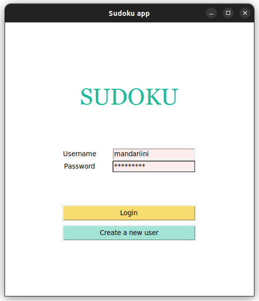
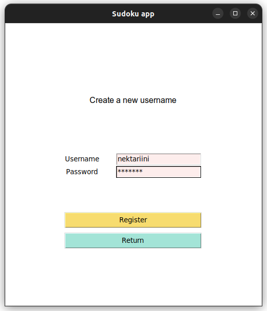
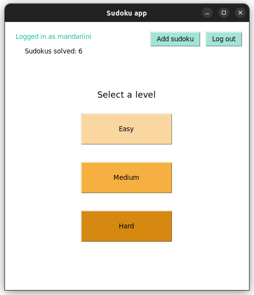
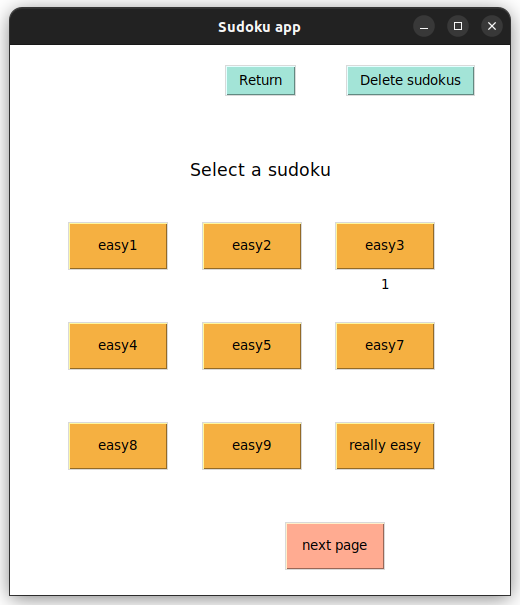

# Käyttöohje

Lataa sovelluksen viimeisimmän [releasen](https://github.com/jnnhan/ot-sudoku/releases) lähdekoodi (zip-tiedosto).

## Pelaaminen

Sudokussa tarkoituksena on täyttää neliönmuotoisen 9 x 9 -ruudukon jokainen ruutu numeroilla 1-9 siten, että jokaisella vaaka- ja pystyrivillä kukin numero esiintyy vain kerran. Myös jokaisessa yhdeksässä 3 x 3 -osaneliössä tulee näiden lukujen esiintyä tasan kerran.

## Sovelluksen käynnistäminen
1. Projektin purkamisen jälkeen siirry juuri luotuun hakemistoon ja asenna riippuvuudet komennolla:
```bash
poetry install
```
2. Suorita alustustoimenpiteet (tietokantojen ja sudokujen luonti) komennolla:
```bash
poetry run invoke init
```
3. Käynnistä sovellus komennolla:
```bash
poetry run invoke start
```

## Kirjautuminen

Sovellus käynnistyy kirjautumisnäkymään:



Kirjautuminen tapahtuu syöttämällä olemassaoleva käyttäjätunnus ja sitä vastaava salasana syötekenttiin ja painamalla "Login"-painiketta.

## Käyttäjätunnuksen luominen

Kirjautumisnäkymästä voi siirtyä uuden käyttäjätunnuksen luontiin painamalla "Create a new user"-painiketta. Avautuviin kenttiin syötetään käyttäjätunnus (vähintään 3 merkkiä) ja salasana (vähintään 4 merkkiä), ja painetaan "Register"-painiketta. 



Jos käyttäjätunnuksen luominen onnistui, sovellus palaa kirjautumisnäkymään.

## Sudokun valinta

Sisäänkirjautumisen onnistuttua siirrytään näkymään, jossa voi valita sudokun vaikeustason tai lisätä sudokuja. Tässä näkymässä näytetään myös käyttäjän ratkaisemien sudokujen lukumäärä (saman sudokun voi ratkaista useasti):



Vaikeustason valinnan jälkeen valitaan jokin sudokuista:



## Pelaaminen

Sudokun valinnan jälkeen siirrytään pelinäkymään:


Mustia numeroita ei voi muuttaa, mutta tyhjiin ruutuihin voi syöttää numeronäppäimillä numeroita. Syöttämällä yhteen ruutuun useamman numeron voi merkitä itselleen apunumeroita, eli ruutuun mahdollisesti tulevia numeroita.

Kaikkien ruutujen ollessa täynnä ja oikein syötettyjä peli päättyy:


Voiton jälkeen sudokun voi ratkaista uudestaan, tai palata takaisin ja valita toisen sudokun.

## Sudokun lisääminen

Sisäänkirjautumisen jälkeen avautuvassa näkymässä painetaan "Add sudoku"-painiketta, jonka jälkeen siirrytään luomaan uusia sudokuja:


Ensin syötetään sudokun nimi ja vaikeustaso, ja sitten kaikki sudokun numerot. Tyhjiä numeroja merkitään numerolla '0'. Sovellus huomauttaa väärän mittaisista syötteistä, tai jos sudokuruudukkoon syötetään muita merkkejä kuin numeroita. Sudokun oikeellisuutta se ei kuitenkaan tarkasta:


Painamalla "Add another sudoku"-painiketta voidaan syöttää lisää uusia sudokuja.

## Sudokun poistaminen

Sudokun vaikeustason valinnan jälkeen avautuvassa näkyvässä painetaan "Delete sudokus"-painiketta sudokujen poistamiseksi. Kerralla voi poistaa yhden tai useamman sudokun:


Valitaan poistettavat sudokut ja painetaan "Confirm"-painiketta. "Cancel"-painiketta painamalla peruutetaan poistotapahtuma.
