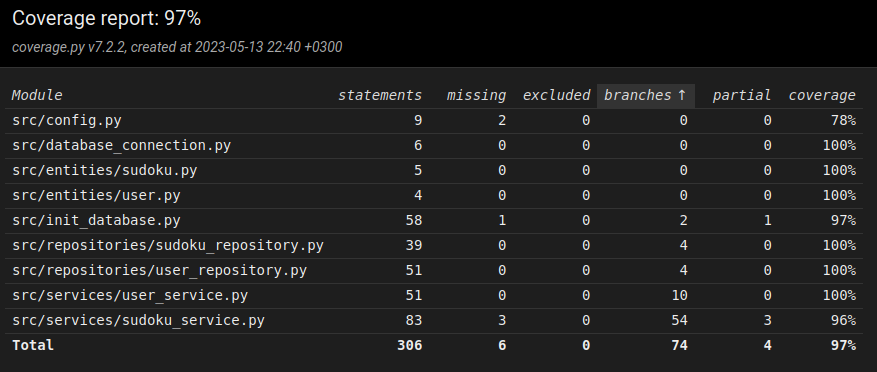

# Testasdokumentti

Sovelluksen toimintaa on testattu unittestin automatisoiduilla yksikkö- ja integraatiotesteillä, sekä manuaalisesti tehdyillä järjestelmätesteillä.

## Yksikkö- ja integraatiotestaus

### Sovelluslogiikka-luokat

Sovelluslogiikan sudokutoiminnallisuuksista vastaavaa luokkaa `SudokuService` testataan [TestSudokuService](https://github.com/jnnhan/ot-sudoku/blob/main/src/tests/services/sudoku_service_test.py)-testiluokan avulla. `SudokuService`-oliolle injektoidaan riippuvuudeksi repositorio-olio `FakeSudokuRepository`, joka tallentaa testidataa muistiin tietokannan sijasta.

Käyttäjätoiminnallisuuksista vastaavaa luokkaa `UserService` taas testataan [TestUserService](https://github.com/jnnhan/ot-sudoku/blob/main/src/tests/services/user_service_test.py)-testiluokan avulla. `UserService`-oliolle injektoidaan riippuvuuksiksi repositorio-olio `FakeUserRepository` ja sovelluslogiikkaolio `FakeSudokuService`.

### Repositorio-luokat

Repositorio-luokkia `SudokuRepository` ja `UserRepository` testataan tallentamalla dataa testitietokantatiedostoon. Tiedoston nimi on konfiguroitu [_.env.test_](https://github.com/jnnhan/ot-sudoku/blob/main/.env.test)-tiedostossa. `SudokuRepository`-luokkaa testataan [TestSudokuRepository](https://github.com/jnnhan/ot-sudoku/blob/main/src/tests/repositories/sudoku_repository_test.py)-testiluokan avulla. `UserRepository`-luokkaa testataan [TestUserRepository](https://github.com/jnnhan/ot-sudoku/blob/main/src/tests/repositories/user_repository_test.py)-testiluokan avulla.

### Testikattavuus

Käyttöliittymäluokka on jätetty testeistä pois. Haarautumakattavuus on näin ollen 97%.

Testaamatta jäivät _config.py_ ja _init_database.py_-tiedostot. Myös _sudoku_service.py_-tiedostosta jäi tarkastamatta muutama ratkaistun sudokun oikeellisuutta käsittelevä rivi.

## Järjestelmätestaus

Järjestelmätestaus on suoritettu manuaalisesti.

### Asennus ja konfigurointi

Sovellus on haettu ja sitä on testattu [käyttöohjeen](https://github.com/jnnhan/ot-sudoku/blob/main/dokumentaatio/kayttoohje.md) mukaan sekä Linux- että Windows-ympäristöissä.

Sovellusta on testattu konfiguroimalla tietokantatiedostoja _.env_-tiedoston kautta. Sovellus luo tiedostot automaattisesti.

### Toiminnallisuudet

[Vaatimusmäärittelydokumentin](https://github.com/jnnhan/ot-sudoku/blob/main/dokumentaatio/vaatimusmaarittely.md) toiminnallisuudet on testattu, ja syötekenttiin kokeiltu syöttää virheellisiä ja tyhjiä arvoja.

## Sovellukseen jääneet virhetilanteet

Mikäli ohjelma suoritetaan ennen käyttöohjeen mukaista `poetry run invoke init` -komentoa, ohjelma tulostaa virheilmoituksen komentoriville, vaikka tästä voisi antaa ilmoituksen sovelluksen sisällä.
