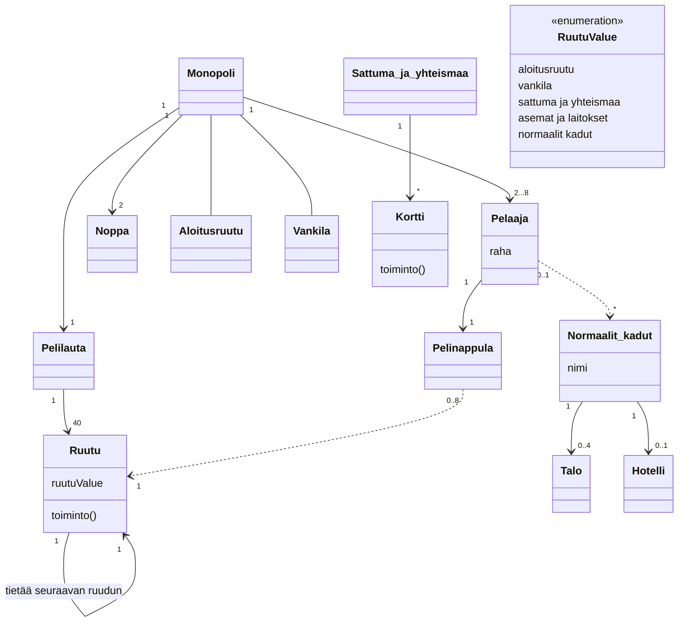

### Luokkakaavio, joka kuvaa laajennetun Monopoli-pelin objekteja ja niiden suhteita

```mermaid
 classDiagram
      Monopoli "1" --> "2...8" Pelaaja
      Monopoli "1" --> "2" Noppa
      Monopoli "1" --> "1" Pelilauta
      Pelilauta "1" --> "40" Ruutu
      Pelaaja "1" --> "1" Pelinappula
      Pelinappula "0..8" ..> "1" Ruutu
      Ruutu "1" --> "1" Ruutu: tietää seuraavan ruudun
      Monopoli -- Aloitusruutu
      Monopoli -- Vankila
      Sattuma_ja_yhteismaa "1" --> "*" Kortti
      Pelaaja "0..1" ..> "*" Normaalit_kadut
      Normaalit_kadut "1" --> "0..4" Talo
      Normaalit_kadut "1" --> "0..1" Hotelli
      class Monopoli{
      }
      class Noppa{
      }
      class Pelaaja{
        raha
      }
      class Pelinappula {
      }
      class Pelilauta {
      }
      class RuutuValue{
        <<enumeration>>
        aloitusruutu
        vankila
        sattuma ja yhteismaa
        asemat ja laitokset
        normaalit kadut
      }
      class Ruutu {
        ruutuValue
        toiminto()
      }
      class Aloitusruutu {
      }
      class Vankila {
      }
      class Sattuma_ja_yhteismaa {
      }
      class Normaalit_kadut {
        nimi
      }
      class Kortti {
        toiminto()
      }
      class Talo {
      }
      class Hotelli {
      }
```