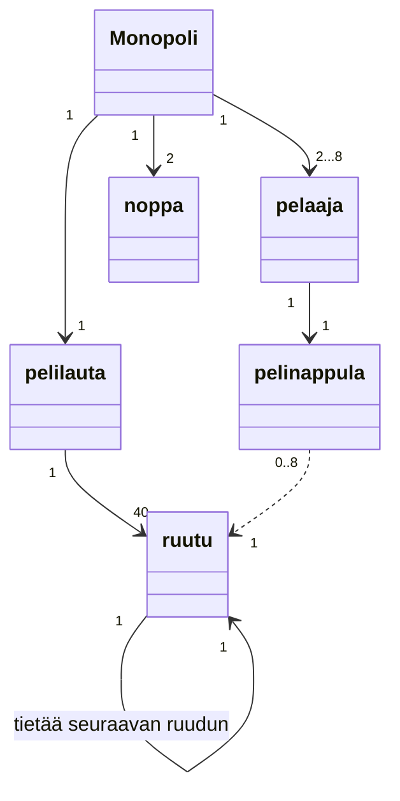

### Luokkakaavio joka kuvaa Monopoli-pelin objekteja ja niiden suhteita

```mermaid
 classDiagram
      Monopoli "1" --> "2...8" pelaaja
      Monopoli "1" --> "2" noppa
      Monopoli "1" --> "1" pelilauta
      pelilauta "1" --> "40" ruutu
      pelaaja "1" --> "1" pelinappula
      pelinappula "0..8" ..> "1" ruutu
      ruutu "1" --> "1" ruutu: tietää seuraavan ruudun
      class Monopoli{
      }
      class noppa{
      }
      class pelaaja{
      }
      class pelinappula {
      }
      class pelilauta {
      }
      class ruutu {
      }
```