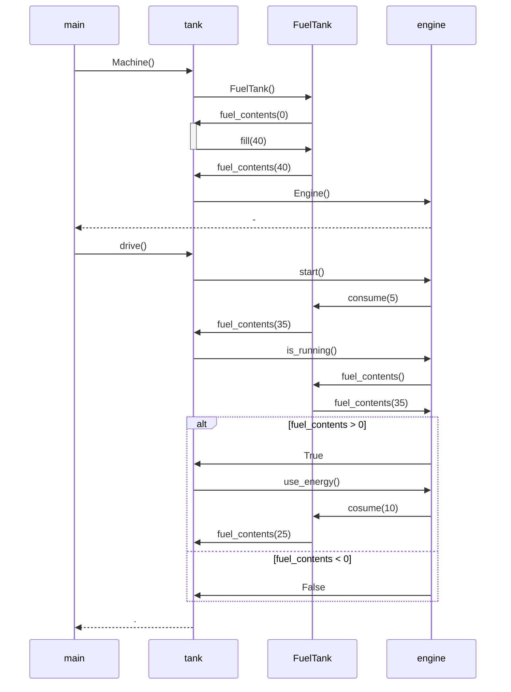

```mermaid
sequenceDiagram
main->>tank: Machine()
tank->>FuelTank: FuelTank()
FuelTank->>tank: fuel_contents(0)
activate tank
tank->>FuelTank: fill(40)
deactivate tank
FuelTank->>tank: fuel_contents(40)

tank->>engine: Engine()
engine-->>main: -

main->>tank: drive()

tank->>engine: start()
engine->>FuelTank: consume(5)
FuelTank->>tank: fuel_contents(35)

tank->>engine: is_running()
engine->>FuelTank: fuel_contents()
    FuelTank->>engine: fuel_contents(35)
alt fuel_contents > 0
    engine->>tank: True
    tank->>engine: use_energy()
    engine->>FuelTank: cosume(10)
    FuelTank->>tank: fuel_contents(25)
else fuel_contents < 0
    engine->>tank: False
end
tank-->>main: .
```